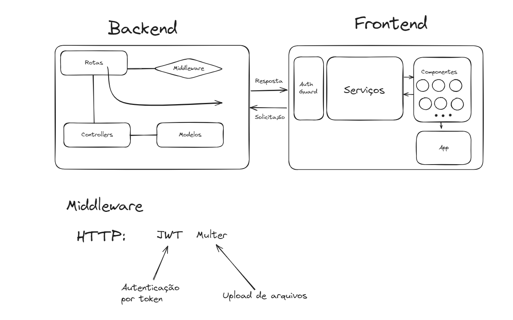

# BasedChat

BasedChat é uma aplicação de chat desenvolvida utilizando o stack MEAN (MongoDB, Express.js, Angular, Node.js). Este projeto replica funcionalidades semelhantes ao WhatsApp, onde os usuários podem adicionar amigos, trocar mensagens, atualizar seu perfil e compartilhar imagens de perfil.



## Funcionalidades

- **Cadastro e Login**: Os usuários podem se registrar e fazer login com um nome de usuário e senha.
- **Lista de Amigos**: Cada usuário pode adicionar outros amigos pelo nome de usuário.
- **Mensagens**: Permite o envio de mensagens de texto em tempo real.
- **Upload de Avatar**: Possibilidade de os usuários fazerem upload de fotos para seus perfis.
- **Perfil Personalizado**: Cada usuário pode definir um status, uma bio e alterar suas informações pessoais.
- **Editar e Deletar Mensagens**: Os usuários podem editar ou deletar mensagens que enviaram.


## Tecnologias Utilizadas

### Backend
- **Node.js**: Ambiente de execução do JavaScript server-side.
- **Express.js**: Framework para construir a API RESTful.
- **MongoDB**: Banco de dados NoSQL para armazenar informações de usuários e mensagens.
- **Mongoose**: Biblioteca para interagir com o MongoDB.
- **JWT (JSON Web Tokens)**: Utilizado para autenticação e proteção das rotas.
- **Multer**: Middleware utilizado para o upload de arquivos (imagens de perfil).

### Frontend
- **Angular**: Framework de desenvolvimento front-end.
- **Angular Material**: Biblioteca de componentes para criar uma interface amigável.
- **HTML/CSS**: Tecnologias base para estrutura e estilização da aplicação.

## Estrutura do Projeto

O projeto está dividido em duas pastas principais:

- **front-end/**: Contém a aplicação Angular que lida com a interface do usuário.
- **back-end/**: Contém a API construída em Node.js e Express para fornecer serviços ao frontend.

### Estrutura de Diretórios
```
BasedChat/
  |
  |-- front-end/basedchat
  |   |-- src/
  |       |-- app/
  |           |-- components/      # Componentes do Angular (chat, login, friends-list, profile, etc)
  |           |-- services/        # Serviços para interações com a API (auth, chat)
  |
  |-- back-end/
      |-- controllers/     # Lógica dos recursos (users, messages)
      |-- middlewares/     # Middlewares como autenticação e upload
      |-- models/          # Modelos Mongoose (User, Message)
      |-- routes/          # Definição das rotas (users, messages)
      |-- uploads/         # Imagens de perfil dos usuários
```

## Como Rodar o Projeto

### Requisitos
- **Node.js** (v14 ou superior)
- **MongoDB** (local ou cloud)
- **Angular CLI**
- **NPM** (ou **Yarn**)

### Passo a Passo

1. **Clone o repositório**
   ```bash
   git clone https://github.com/seu-usuario/basedchat.git
   cd basedchat
   ```

2. **Configure o Backend**
   - Navegue até a pasta `back-end`:
     ```bash
     cd back-end
     ```
   - Instale as dependências:
     ```bash
     npm install
     ```
   - Crie o diretório de uploads:
     ```bash
     mkdir uploads
     ```
   - Inicie o servidor:
     ```bash
     nodemon
     ```
   - O servidor será iniciado na porta 3000 (http://localhost:3000).

3. **Configure o Frontend**
   - Navegue até a pasta `front-end`:
     ```bash
     cd ../front-end/basedchat
     ```
   - Instale as dependências:
     ```bash
     npm install
     ```
   - Inicie a aplicação Angular:
     ```bash
     ng serve --open
     ```
   - O front-end será iniciado na porta 4200 (http://localhost:4200).

## Endpoints da API

### Autenticação
- `POST /api/users/register`: Registra um novo usuário.
- `POST /api/users/login`: Faz login e retorna um token JWT.

### Usuários
- `GET /api/users/friends`: Obter a lista de amigos do usuário autenticado.
- `POST /api/users/add-friend`: Adicionar um amigo pelo nome de usuário.
- `POST /api/users/upload-avatar`: Fazer upload da imagem de perfil do usuário.

### Mensagens
- `GET /api/messages/:chatId`: Obter as mensagens de um chat.
- `POST /api/messages`: Enviar uma nova mensagem.
- `PUT /api/messages/:messageId`: Editar uma mensagem.
- `DELETE /api/messages/:messageId`: Deletar uma mensagem.

## Melhorias Futuras

- **WebSockets**: Implementar WebSockets para mensagens em tempo real.
- **Paginação de Mensagens**: Adicionar paginação ao carregar conversas longas.
- **Melhorias de UI/UX**: Implementar animações e melhorar o design com Angular Animations e Shadcn/UI.
- **Notificações**: Notificações para mensagens novas e usuários online.

## Contribuindo

Sinta-se livre para contribuir com este projeto! Abra um pull request com suas melhorias ou reporte problemas no repositório.

1. Faça um fork do projeto.
2. Crie uma branch com sua feature (`git checkout -b minha-feature`).
3. Commit suas mudanças (`git commit -m 'Adicionando minha feature'`).
4. Envie a branch (`git push origin minha-feature`).
5. Abra um Pull Request.

## Licença
Este projeto é licenciado sob a [MIT License](LICENSE).

## Agradecimentos
Agradecemos a todos que contribuíram e ajudaram a fazer o BasedChat acontecer! 🚀

